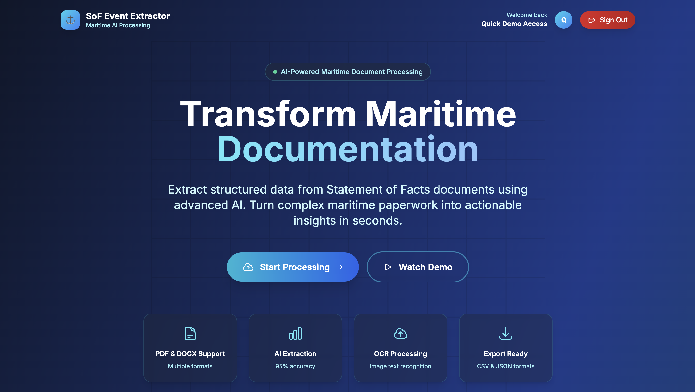
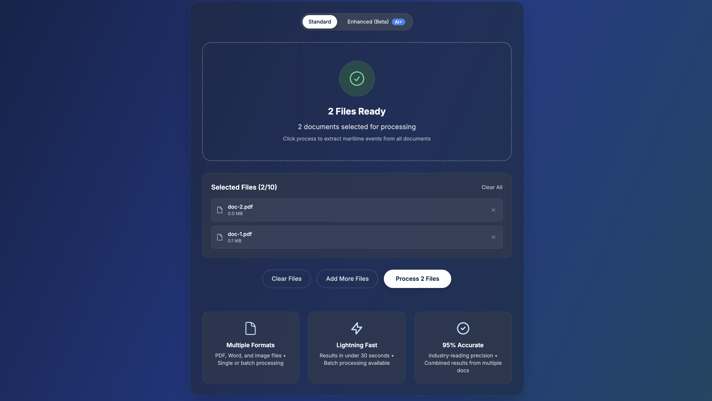
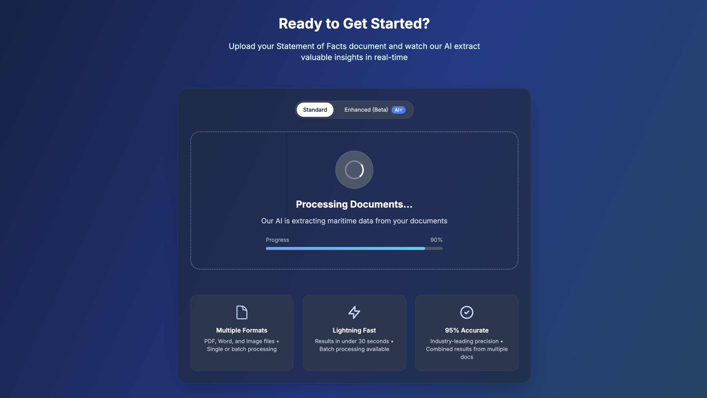
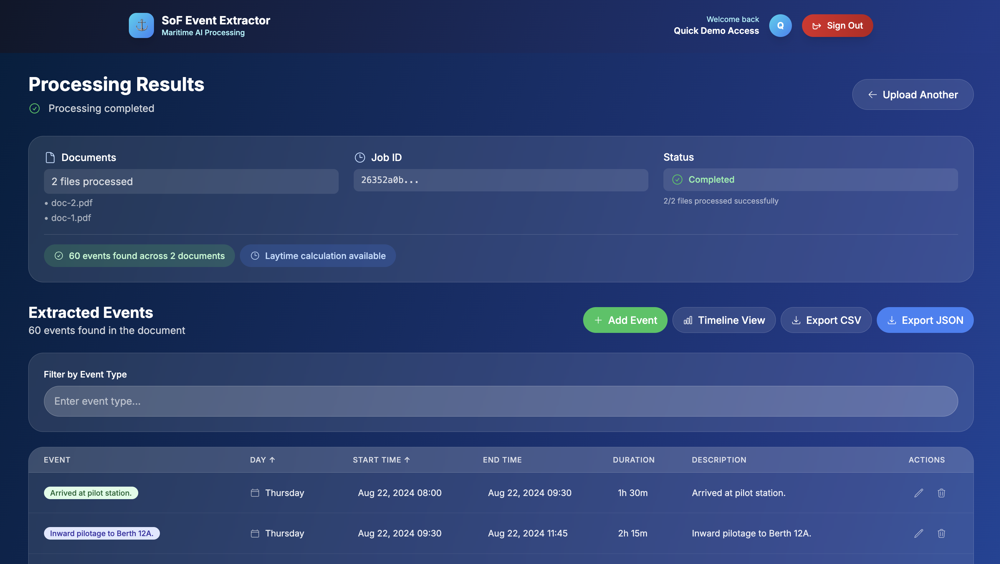
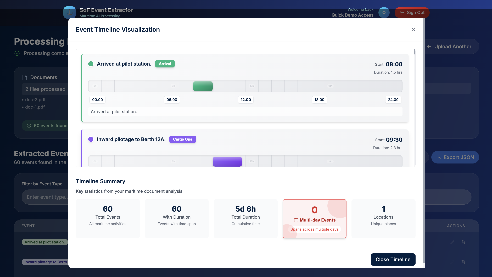
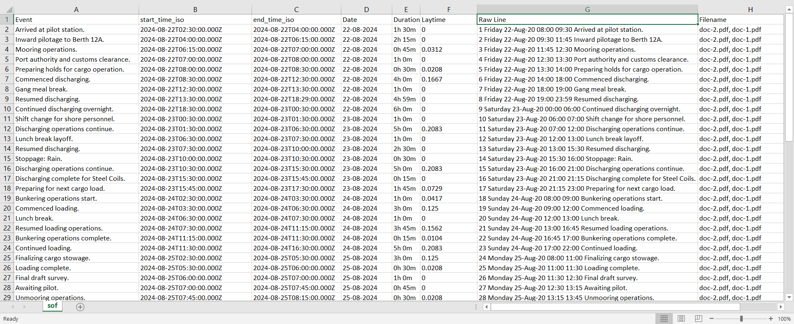
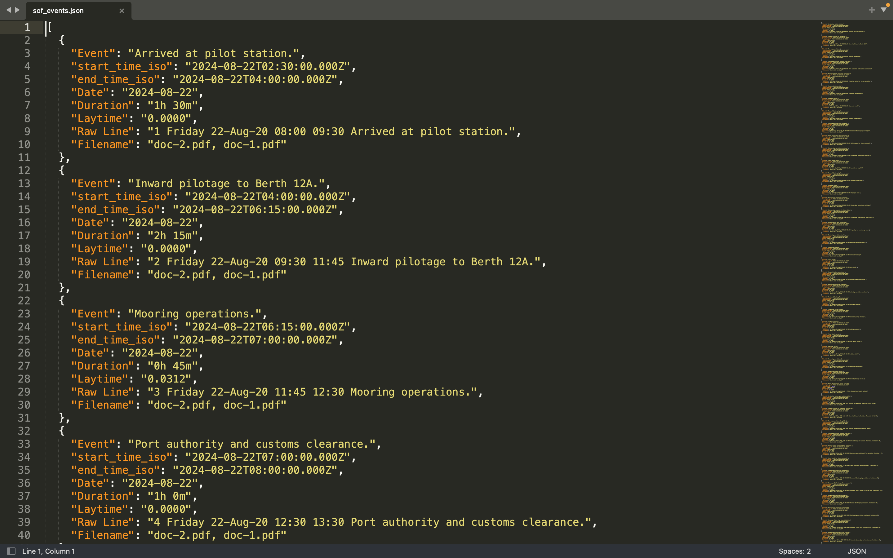

<div align="center">

# ⚓ SoF EVENT EXTRACTOR

</div>

<div align="center">
  <p><em>An intelligent maritime document processing platform that transforms unstructured Statement of Facts into actionable timeline data using advanced AI.</em></p>

  <p>
    
    
    
    
  </p>

  <a href="https://tbi-x-ime-hackathon-frontend.onrender.com/" target="_blank">
    
  </a>
  <br /><br />
  <a href="https://youtu.be/FjC9vwCJo_E">
    
  </a>
  <br /><br />
  <a href="https://youtu.be/FjC9vwCJo_E" target="_blank">
    
  </a>
</div>

---

## Overview

**SoF Event Extractor** is an AI-powered maritime platform that:

* Processes unstructured Statement of Facts documents
* Extracts maritime events with 95%+ accuracy using the Google Gemini API
* Generates interactive timelines and visualizations automatically
* Provides results through a modern web interface and RESTful APIs

This solution transforms hours of manual document processing into seconds of automated intelligence.

---

## Core Features

| Feature                  | Description                                                 |
| ------------------------ | ----------------------------------------------------------- |
| **AI Processing**        | Google Gemini integration for document understanding        |
| **Multi-Format Support** | Handles PDF, DOCX and images with OCR                      |
| **Timeline Generation**  | Automatic chronological visualization of events             |
| **Enterprise API**       | RESTful endpoints with JWT authentication and documentation |

---

## Technology Stack

| Component       | Technology           | Badge                                                                                                    |
| --------------- | -------------------- | -------------------------------------------------------------------------------------------------------- |
| Backend     | Python, FastAPI |          |
| Frontend        | React, Tailwind |               |
| Authentication  | JWT         |         |
| AI Processing   | Google Gemini API    |     |
| OCR             | Tesseract            |                                                   |
| PDF Processing  | PyMuPDF, pdfplumber  |                                                   |
| Deployment      | Render.com           |            |

---

## Architecture

1. **Document Upload** → FastAPI backend
2. **Text Extraction** → Tesseract/PyMuPDF extract raw text from SoF documents
2. **AI Processing** → Google Gemini API interprets extracted text and identifies maritime events
3. **Data Structuring** → Events organized into structured timelines
4. **Frontend** → React interface for visualization and interaction

---

## Showcase

<div align="center">
  
  <p><em>Drag-and-drop interface for document upload</em></p>
</div>

<div align="center">
  
  <p><em>Real-time AI analysis and event extraction</em></p>
</div>

<div align="center">
  
  <p><em>Results dashboard with filtering and export options</em></p>
</div>

<div align="center">
  
  <p><em>Interactive timeline of extracted events</em></p>
</div>

<div align="center">
  
  <p><em>Exported CSV output</em></p>
</div>

<div align="center">
  
  <p><em>Exported JSON output</em></p>
</div>


---

## Performance & Security

**Performance**

* Speed: 30-45 seconds per document
* Accuracy: 95%+ on maritime SoF documents
* Multiple File Support: PDF, DOCX, PNG, JPG, JPEG

**Security**

* JWT-based authentication
* File validation and input sanitization
* Encrypted data handling

---

## Innovation Highlights

* Custom prompt engineering for maritime context
* Google Gemini API for natural language understanding
* Automated event structuring with timeline generation

---

## Business Impact

* Reduces manual effort by 90%
* Eliminates errors in extraction
* Automates compliance-ready documentation

---

## Local Development Setup

```bash
# Clone
git clone https://github.com/lol782/sof-event-extractor.git
cd sof-event-extractor

# Setup
chmod +x setup.sh
./setup.sh
```

Access:

* Frontend → `http://localhost:3000`
* Backend API → `http://localhost:8000`

### Key Endpoints

* `POST /api/auth/register` – Register user
* `POST /api/auth/login` – User login
* `POST /api/process/upload` – Upload documents
* `GET /api/process/result/{job_id}` – Results

### Environment Variables

**Backend**

```env
SECRET_KEY=your-jwt-secret-key
GOOGLE_API_KEY=your-google-gemini-api-key
```

**Frontend**

```env
REACT_APP_API_URL=https://your-backend-url.onrender.com
```

---

## Project Structure

```
sof-event-extractor/
├── backend/
│   ├── app.py
│   ├── requirements.txt
│   ├── models/
│   └── utils/
│       ├── auth.py
│       ├── sof_pipeline.py
|       |..
├── frontend/
│   ├── src/
│   │   ├── components/
│   │   ├── contexts/
│   │   ├── pages/
│   │   └── config.js
│   ├── public/
│   └── package.json
├── images/
└── setup.sh
```

---

### Upcoming Features

- **Advanced Search**: Full-text search across processed documents
- **Analytics Dashboard**: Comprehensive reporting and insights
- **Multi-language Support**: Support for multiple languages
- **Enhanced AI**: Improved accuracy with custom models

---

## Acknowledgments

* **Google Gemini API** for AI-powered document analysis
* **FastAPI** for backend framework
* **React + Tailwind CSS** for modern frontend
* **Render.com** for deployment

---

## Connect with the Developers

<div align="center">
  <a href="https://www.linkedin.com/in/rajadigvijaysingh/" target="_blank">
    
  </a>
  <a href="https://linkedin.com/in/rahul-koranga-656785258" target="_blank">
    
  </a>
  <a href="https://www.linkedin.com/in/sourab-singh-bora-3b896424b" target="_blank">
    
  </a>
</div>
